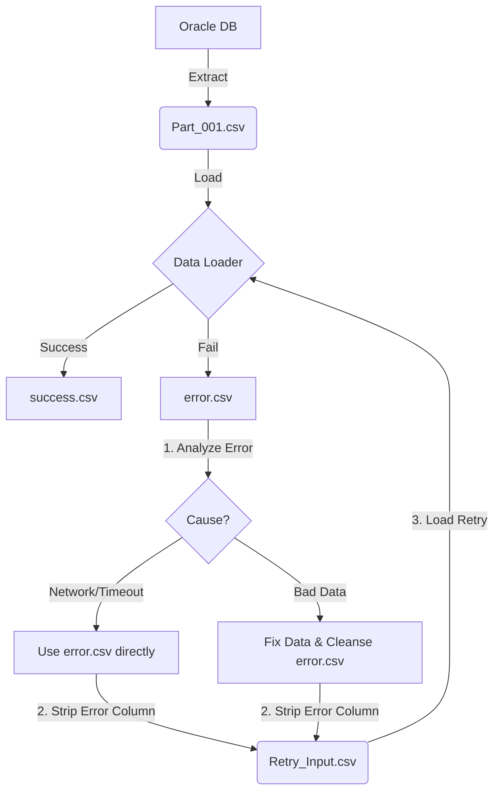

# กลยุทธ์การจัดการ Configuration ของ Salesforce Data Loader

เอกสารฉบับนี้อธิบายแนวทางการปรับปรุง Architecture ของระบบ Data Migration เพื่อแก้ปัญหาการแย่งกันเขียนไฟล์ (File Contention/Race Condition) และเพิ่มประสิทธิภาพในการทำงาน

## 1. ปัญหาที่พบ (Current Problem)

ปัจจุบัน DAG แต่ละตัว (เช่น `migrate_sample_dag`) มีหน้าที่ Generate ไฟล์ `process-conf.xml` ขึ้นมาใหม่ทุกครั้งก่อนทำงาน (Just-in-Time Generation)

**ความเสี่ยง:**

* **Race Condition:** หากมี Migration DAG หลายตัวรันพร้อมกัน (Parallel Execution) ทุกตัวจะพยายามเขียนไฟล์ `process-conf.xml` ไฟล์เดียวกัน ทำให้ไฟล์ Config ของ Job A อาจถูกเขียนทับโดย Job B ส่งผลให้ Job A หา Config ของตัวเองไม่เจอและ Failed
* **Performance Overhead:** การ Generate Config ใหม่ทุกครั้งเป็นการทำงานซ้ำซ้อนโดยไม่จำเป็น หาก Mapping ไม่ได้มีการเปลี่ยนแปลง

## 2. แนวทางแก้ไข: Centralized Setup DAG Pattern

เราจะเปลี่ยนวิธีการจัดการ Config จาก "ทำเมื่อจะใช้" (Just-in-Time) เป็น **"เตรียมไว้ล่วงหน้า" (Ahead-of-Time)** โดยรวมศูนย์การจัดการไว้ที่ DAG เดียว

### Architecture Overview

แบ่งหน้าที่ของ DAG ออกเป็น 2 ประเภทชัดเจน:

#### A. Setup DAG (`setup_salesforce_pipeline`)

*พัฒนาต่อยอดมาจาก `utility_encrypt_password`*

**หน้าที่ (Responsibilities):**

1. **Credential Management:**
    * สร้างหรือใช้ Encryption Key เดิม
    * รวม Password + Security Token เข้าด้วยกัน
    * Encrypt Credential และบันทึกลง Airflow Variables
2. **Global Configuration Generation:**
    * อ่านค่าจาก `tables_config.py` (Source of Truth)
    * สร้างไฟล์ **Master `process-conf.xml`** ที่รวม `<bean>` ของ **ทุกตาราง** ไว้ในไฟล์เดียว
    * สร้างไฟล์ `.sdl` (Mapping) ของทุกตารางเตรียมไว้
3. **Validation:**
    * ตรวจสอบความถูกต้องของ Credentials (Test Login)

**Trigger:** รัน Manual เมื่อมีการ Deploy Code ใหม่, เปลี่ยน Password, หรือแก้ Mapping

#### B. Execution DAGs (`migrate_table_X`, `migrate_table_Y`)

**หน้าที่ (Responsibilities):**

1. **Extract:** ดึงข้อมูลจาก Oracle
2. **Load:** เรียกใช้ script `process.sh` โดยระบุชื่อ Process Bean ที่ต้องการ (เช่น `KPS_T_SALES_MD_Process`)

**สิ่งที่เปลี่ยนแปลง:**

* ❌ **ไม่ต้อง** Generate Config ใหม่ใน DAG นี้
* ✅ **อ่าน** Config จากไฟล์ Master `process-conf.xml` ที่ Setup DAG เตรียมไว้ให้แล้ว

---

### 3. โครงสร้างไฟล์ (File Structure)

```text
/opt/airflow/salesforce/
├── certs/
│   └── key.txt                # จัดการโดย Setup DAG
├── dataloader_conf/
│   ├── process-conf.xml       # Master Config (รวม Config ของทุกตารางในไฟล์เดียว)
│   ├── config.properties      # Global settings
│   └── mappings/
│       ├── KPS_T_SALES_MD.sdl
│       ├── KPS_T_INVOICE.sdl
│       └── ...
└── data/                      # Input CSVs (แยกไฟล์ตามตาราง)
└── logs/                      # Log files
```

### 4. ขั้นตอนการทำงาน (Workflow)

1. **เมื่อมีการ Deploy หรือแก้ Config:**
    * Developer อัปเดตไฟล์ `tables_config.py` หรือ `field_mappings.py`
    * Deploy Code ขึ้น Server
    * **Action:** สั่งรัน DAG `setup_salesforce_pipeline` **เพียง 1 ครั้ง**
    * *Result:* ไฟล์ `process-conf.xml` และ `.sdl` ทั้งหมดจะถูกสร้างขึ้นใหม่พร้อมใช้งาน

2. **เมื่อถึงเวลา Migration (Daily Schedule):**
    * Scheduler สั่งรัน `migrate_sales` และ `migrate_invoices` พร้อมกัน
    * Job A เรียก Bean `Sales_Process` (อ่านไฟล์ xml)
    * Job B เรียก Bean `Invoice_Process` (อ่านไฟล์ xml เดียวกัน)
    * *Result:* ทำงานได้พร้อมกันโดยไม่ชนกัน เพราะเป็นการ **Read-Only** ที่ไฟล์ Config

### 6. กลยุทธ์สำหรับข้อมูลขนาดใหญ่ (Large Data Volume Strategy)

กรณีที่ข้อมูลมีปริมาณมหาศาล (เช่น 300 ล้าน Records) การ Extract เป็นไฟล์เดียวอาจทำให้ Memory เต็ม หรือ Data Loader ทำงานช้าจน Timeout เราจะใช้กลยุทธ์ **"Chunking + Dynamic Config Override"**:

#### 1. Concept

* **Extract:** ดึงข้อมูลทีละส่วน (Chunking) เช่น ทีละ 10 ล้าน Records แยกเป็นหลายไฟล์ (`part_001.csv`, `part_002.csv`, ...)
* **Load:** สั่ง Data Loader รันหลายรอบ (Loop) โดยใช้ Process Config เดิม (`Bean`) แต่ **Override** ค่า `dataAccess.name` ให้ชี้ไปทีละไฟล์

#### 2. สิ่งที่ต้องปรับปรุง (Implementation Required)

**A. Docker (`process.sh`):**
ต้องแก้ script Wrapper ให้รองรับการส่ง Parameter เพิ่มเติมเพื่อ Override ค่า Config:

```bash
# process.sh
java ... com.salesforce.dataloader.process.DataLoaderRunner \
    salesforce.config.dir="$1" \
    process.name="$2" \
    "$3" # รับ variable เพิ่มเติม เช่น "dataAccess.name=/path/to/part_1.csv"
```

**B. Airflow DAG (`migrate_large_table`):**
ใช้ **Dynamic Task Mapping** ของ Airflow เพื่อกระจายงาน:

1. **Task 1 (Listing):** หาไฟล์ทั้งหมดที่ Extract มาได้ (`[file_1.csv, file_2.csv, ...]`)
2. **Task 2 (Loading):** Map ไฟล์เหล่านั้นเข้ากับ Data Loader Operator

    ```python
    # Pseudo-code
    run_dataloader.expand(
        bash_command=f"/opt/dataloader/process.sh {CONF_DIR} {PROCESS} 'dataAccess.name={{ file_path }}'"
    )
    ```

**ข้อดี:**

* ใช้ Config เดิมจาก Setup DAG ได้เลย ไม่ต้องสร้าง Bean ใหม่สำหรับทุกไฟล์
* ถ้าไฟล์ไหน Error สามารถ Retry เฉพาะไฟล์นั้นได้ (Granular Retry)
* สามารถรันหลายไฟล์พร้อมกัน (Parallelism) เพื่อความรวดเร็ว

---

---

### 7. กลยุทธ์การตรวจสอบและการซ่อมข้อมูล (Audit Log & Reconciliation Strategy)

เมื่อต้องจัดการข้องมูลปริมาณมาก (Multi-Tables, Millions of Records) เราไม่สามารถพึ่งพาแค่ Airflow Logs ได้ เราต้องการ **"Persistent Audit Log"** ที่เก็บสถานะของ *ทุกไฟล์* ที่ถูกส่งออกไป

#### A. Database Schema สำหรับ Audit Log

เราจะใช้ **PostgreSQL** (ซึ่งเป็น Database Server เดียวกับของ Airflow) ในการเก็บ Audit Log ทั้งหมด เพื่อแยก Workload ออกจาก Production Oracle DB

**Table Name:** `MIGRATION_AUDIT_LOG`

| Column Name | Type | Description |
| :--- | :--- | :--- |
| `JOB_ID` | VARCHAR | Airflow DAG Run ID |
| `TABLE_NAME` | VARCHAR | ชื่อตาราง (e.g., KPS_T_SALES_MD) |
| `FILE_NAME` | VARCHAR | ชื่อไฟล์ย่อย (e.g., part_001.csv) |
| `STATUS` | VARCHAR | `PENDING`, `SUCCESS`, `PARTIAL`, `FAILED` |
| `TOTAL_RECORDS` | NUMBER | จำนวน Record ทั้งหมดในไฟล์นี้ |
| `SUCCESS_COUNT` | NUMBER | จำนวนที่ยิงเข้าสำเร็จ |
| `ERROR_COUNT` | NUMBER | จำนวนที่ Error |
| `ERROR_LOG_PATH` | VARCHAR | Path ของไฟล์ Error CSV (เพื่อเอาไป Retry) |
| `CREATED_AT` | TIMESTAMP | เวลาเริ่ม |
| `UPDATED_AT` | TIMESTAMP | เวลาอัปเดตล่าสุด |

#### B. Workflow การทำงาน (Audit Loop)

1. **Pre-Process (Before Load):**
    * DAG ทำการ Insert Record ลง `MIGRATION_AUDIT_LOG` สถานะ `PENDING`
    * บันทึก `TOTAL_RECORDS`
2. **Process (Loading):**
    * รัน Data Loader (`process.sh`)
3. **Post-Process (After Load):**
    * Python Task อ่านไฟล์ `success.csv` และ `error.csv` ที่ Data Loader สร้างมา
    * นับจำนวนแถว (Row Count)
    * **Logic การสรุปผล:**
        * Error = 0 $\rightarrow$ `SUCCESS`
        * Error > 0 และ Success > 0 $\rightarrow$ `PARTIAL`
        * Success = 0 $\rightarrow$ `FAILED`
    * Update สถานะลง Table `MIGRATION_AUDIT_LOG`

#### C. การซ่อมข้อมูล (Reconciliation & Retry) - Best Practice Flow

**คำถามสำคัญ:** *"ต้องไปดึงข้อมูลจาก Database ใหม่หรือไม่?"*
**คำตอบ:** **"ไม่ต้อง"** (และไม่ควรทำ ในกรณีส่วนใหญ่)

การดึงข้อมูลใหม่จาก Oracle (300M Records) นั้น "แพง" และเสียเวลามาก Best Practice คือการใช้ไฟล์ `error.csv` ที่ Data Loader คายออกมาให้เป็นประโยชน์

**Workflow การ Retry (Failover Flow):**



**ขั้นตอนการทำ Automated Retry:**

1. **Input Source:**
    * ใช้ไฟล์ `MIGRATION_AUDIT_LOG` หาไฟล์ที่มี Status = `PARTIAL` หรือ `FAILED`
    * ระบุ path ของ file `error.csv`

2. **Cleanse Process (Python Script):**
    * อ่านไฟล์ `error.csv`
    * **ลบ Column สุดท้าย** (ซึ่งจะเป็น Error Message จาก Salesforce เช่น "Error: Invalid Email") ออก เพื่อให้เหลือโครงสร้างเหมือน Input CSV ปกติ
    * Save เป็นไฟล์ใหม่ เช่น `retry_<original_name>.csv`

3. **Deploy Retry (Load):**
    * ส่งไฟล์ `retry_...csv` เข้า Data Loader Process ตัวเดิม
    * (Optional) อาจจะลด Batch Size ลง ถ้า Error เกิดจาก Timeout

4. **Loop:**
    * ทำซ้ำจนกว่า Error Count = 0 หรือเหลือเฉพาะข้อมูลที่ "แก้ไม่ได้จริงๆ" (Permanent Failure) ถึงจะส่ง Report ให้คนไปแก้ที่ Source (Oracle)

#### D. การตรวจสอบฝั่งต้นทาง (Source-Side Reconciliation)

นอกจากการเช็คว่า "ส่งไปเท่าไหร่" (Audit Log) เราต้องเช็คด้วยว่า **"ข้อมูลในต้นทางถูกส่งไปครบจริงหรือไม่"**

**Best Practice:** ทำ **"Closed-Loop Feedback"** กลับไปที่ Oracle

1. **Add Tracking Column (ที่ Oracle):**
    * เพิ่ม Column `MIGRATION_STATUS` (Default: NULL) และ `MIGRATION_DATE` ในตาราง Source (หรือสร้างตารางแยก `KPS_SALES_MIGRATION_TRACK` ถ้าแตะต้องตารางจริงไม่ได้)

2. **Feedback Loop Process (After Load):**
    * หลังจากได้ไฟล์ `success.csv` (ซึ่งจะมี ID ของ Oracle หรือ External ID ที่เราส่งไป)
    * สร้าง Python Task (`update_source_status`) อ่านไฟล์ `success.csv`
    * รวบรวม ID ที่สำเร็จทั้งหมด
    * ยิง SQL Batch Update กลับไปที่ Oracle:

        ```sql
        UPDATE KPS_T_SALES_MD
        SET MIGRATION_STATUS = 'SUCCESS', MIGRATION_DATE = SYSDATE
        WHERE SALE_ID IN (...list of success IDs...);
        ```

3. **Final Quality Gate (Validation):**
    * ก่อนปิด Job ใหญ่ ให้รัน SQL Check:

        ```sql
        SELECT COUNT(*) FROM KPS_T_SALES_MD WHERE MIGRATION_STATUS IS NULL;
        ```

    * ถ้า Count > 0 แปลว่า "ตกหล่น" (ไม่ได้ถูก Extract หรือ Extract แล้วแต่หายไปกลางทาง) $\rightarrow$ **ต้องสอบสวนทันที**

---

#### E. การจัดการ Field Mapping (กรณีซับซ้อน/หลาย Table Join)

**คำถาม:** *"Field Source Map ยังไงกับ Salesforce? ต้องทำตอนไหน? ถ้า Source ต้อง Join หลาย Table ทำยังไง?"*

**คำตอบ:**
เราแบ่งกระบวนการ Mapping ออกเป็น 2 ส่วนชัดเจน คือ **Logical Mapping** (ใน Code) และ **Physical Mapping** (ใน Database Query)

1. **Logical Mapping (`field_mappings.py`):**
    * **ทำตอนไหน?**: เป็น Static Configuration ที่กำหนดไว้ใน Code ตั้งแต่ Deploy
    * **หน้าที่**: จับคู่ชื่อ Column ของ CSV เข้ากับ API Name ของ Salesforce
    * **ตัวอย่าง**:

        ```python
        # dags/config/field_mappings.py
        "KPS_T_SALES_MD": FieldMapping(
             sf_object="KPS_Sales__c",
             mappings={
                 "SALE_NO": "External_ID__c",  # Source -> Target
                 "SHOP_CODE": "Store_Code__c",
                 # ...
             }
        )
        ```

    * *Setup DAG จะอ่านไฟล์นี้ไปสร้าง `.sdl` (Salesforce Mapping File) เตรียมไว้ให้*

2. **Physical Extraction (SQL Query):**
    * **ทำตอนไหน?**: ตอนรัน Extraction Task ใน DAG (`tables_config.py` หรือ Custom SQL)
    * **กรณี Join หลาย Table**: ให้จัดการ Logic ทั้งหมดใน **SQL Query** ที่ใช้ดึงข้อมูล
    * **หลักการ**: *"Make the Source look like the Target"* (ปรับหน้าตาข้อมูลให้พร้อมตั้งแต่ตอนดึง)
    * **ตัวอย่าง**:

        ```sql
        SELECT
            s.SALE_NO,
            s.SALE_DATE,
            c.CUSTOMER_NAME,     -- Join จาก Customer Table
            p.PRODUCT_CODE       -- Join จาก Product Table
        FROM KPS_T_SALES_MD s
        JOIN KPS_M_CUSTOMER c ON s.CUST_ID = c.ID
        JOIN KPS_M_PRODUCT p ON s.PROD_ID = p.ID
        -- ...
        ```

    * ผลลัพธ์ที่ได้จะเป็น Flat CSV ที่มี Column ตรงกับที่ Define ไว้ใน `field_mappings.py` เป๊ะๆ ทำให้ Data Loader ทำงานง่ายที่สุด

---

## สรุป (Conclusion)

แนะนำให้ใช้แนวทาง **Centralized Setup DAG** เพื่อความเสถียรของระบบ (Stability) รองรับการรัน Parallel ได้จริง และเป็น Best Practice สำหรับการจัดการ Data Loader ใน Environment ที่เป็น Automation
