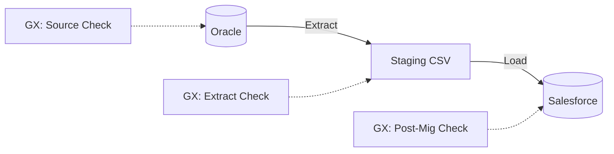

# Design: Product Price Reconciliation & GX Integration

## Architecture

We will follow the pattern defined in `docs/GREAT_EXPECTATIONS_GUIDE.md`.

### Component Diagram

## Implementation Details

### 1. Great Expectations Setup

- **Root:** `great_expectations/`
- **Datasources:**
  - `oracle_kpc`: SQLAlchemy connection to Oracle.
  - `staging_filesystem`: Pandas execution engine for CSVs.
  - `salesforce_prod`: (Optional for v1) Use simplistic checking via Export or API query if possible, or simple row counts.

### 2. Expectation Suites

| Suite Name | Purpose | Key Expectations |
| match | --- | --- |
| `source_product_price` | Validate Oracle Source | `expect_column_values_to_not_be_null(BARCODE)`, `row_count > 0` |
| `extract_product_price` | Validate Staging CSV | `expect_table_row_count_to_equal(source_count)` |
| `postmig_product_price` | Validate Salesforce | `expect_table_row_count_to_equal(sf_count)` |

### 3. DAG Changes

- **New Task:** `validate_source` (PythonOperator calling GX or GreatExpectationsOperator)
- **New Task:** `validate_extract`
- **Modified Task:** `audit_results` -> Enhanced to include GX validation results or separated into `validate_postmig`.

## Constraints

- **Airflow Provider:** Need to ensure `airflow-provider-great-expectations` is available or use `PythonOperator` with standard `great_expectations` library if the provider is too heavy/complex for the current setup.
