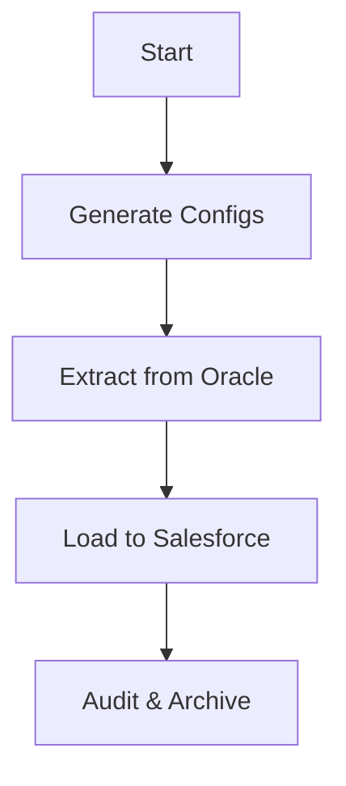

# Design: Sample ETL DAG for KPS_T_SALES_MD

## Architecture

The workflow follows the **Extract-Load** pattern (ELT/ETL) orchestrated by Airflow.

### Components

1. **Generate Configs (`generate_configs.py`)**
    * Ensures that `process-conf.xml` and `.sdl` files are consistent with the latest code definitions.
    * Executed via `PythonOperator` or `BashOperator`.

2. **Extraction (`OracleToCSV`)**
    * **Source**: Oracle Table `KPS_T_SALES_MD`
    * **Destination**: CSV File at `${AIRFLOW_HOME}/salesforce/data/KPS_T_SALES_MD.csv`
    * **Logic**:
        * Connects using `OracleHook`.
        * Selects columns matching `field_mappings.py`.
        * Applies basic transformations (Date format, etc.) if needed by Data Loader (though Data Loader handles some, preprocessing in Python is safer).
        * **Limit**: For this sample DAG, we may limit to 100-1000 records.

3. **Loading (`SalesforceDataLoader`)**
    * **Tool**: Salesforce Data Loader CLI (via `process.sh`)
    * **Command**: `/opt/dataloader/process.sh /opt/dataloader/config KPS_T_SALES_MD_Process`
    * **Environment**: Requires Java and Data Loader binaries (available in our custom Docker image).

4. **Audit (`ResultAnalyzer`)**
    * Checks `${AIRFLOW_HOME}/salesforce/logs/KPS_T_SALES_MD_error.csv`.
    * If rows > 0 (excluding header), fail the task or send alert.

## Airflow Implementation Details

* **DAG ID**: `migrate_sample_kps_t_sales_md`
* **Schedule**: `None` (Manual)
* **Operators**:
  * `PythonOperator` for Python logic (Extract, Audit).
  * `BashOperator` for Data Loader execution.
