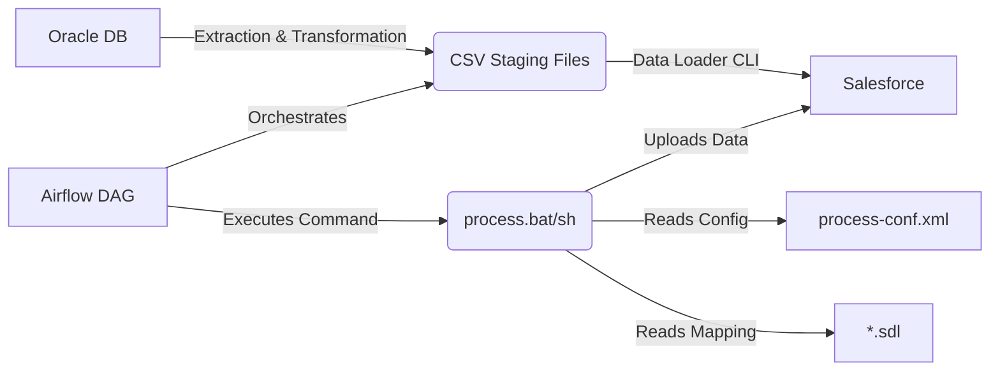

# Salesforce Data Loader Configuration Strategy

เอกสารนี้อธิบายรายละเอียดเชิงลึกเกี่ยวกับการตั้งค่า Salesforce Data Loader สำหรับโปรเจกต์ **KPC TMS Data Migration** โดยเชื่อมโยงกับการตั้งค่าใน Codebase (`tables_config.py` และ `field_mappings.py`) ไปยังไฟล์ Configuration ของ Data Loader (`process-conf.xml` และ `.sdl`)

## 1. ภาพรวมสถาปัตยกรรม (Architecture Overview)

กระบวนการ Data Migration จะทำงานเป็น Pipeline ดังนี้:



1. **Airflow DAG**: อ่าน Config จาก `tables_config.py`
2. **Python Script**: ดึงข้อมูลจาก Oracle, แปลงข้อมูล (Transform), และสร้างไฟล์ CSV ที่มี Header ตรงกับ Key ใน `mappings`
3. **Data Loader**: อ่านไฟล์ CSV และใช้ไฟล์ `.sdl` เพื่อ Map Header ไปยัง Field ปลายทางใน Salesforce

## 2. โครงสร้างไฟล์ (Directory Structure)

แนะนำให้จัดโครงสร้างไฟล์ในเครื่อง Server (หรือ Container) ดังนี้เพื่อความเป็นระเบียบและสอดคล้องกับ Script:

```
/opt/dataloader/
├── bin/                    # โปรแกรม Data Loader
├── certs/                  # เก็บ Key สำหรับ Decrypt Password
│   └── key.txt
├── config/                 # เก็บไฟล์ตั้งค่าทั้งหมด
│   ├── process-conf.xml    # ไฟล์รวม Config ของทุก Table
│   ├── database-conf.xml   # (ถ้าใช้โหมด DB Direct - โปรเจกต์นี้ใช้ CSV ไม่ต้องมี)
│   └── mappings/           # โฟลเดอร์เก็บไฟล์ Mapping แยกราย Table
│       ├── KPS_Sales_MD.sdl
│       ├── KPS_SalesPay_MD.sdl
│       └── ...
├── data/                   # โฟลเดอร์วางไฟล์ CSV (Staging Area)
│   ├── KPS_Sales_MD.csv
│   └── ...
└── logs/                   # เก็บ Log การรัน (Success/Error Files)
```

## 3. การแปลง Configuration (Configuration Mapping)

เราจะแปลงค่าจาก Python Config ใน `dags/config/` เป็น Data Loader Config ดังนี้:

### 3.1 Field Mapping (.sdl Files)

จากไฟล์ `dags/config/field_mappings.py`:

```python
"KPS_T_SALES_MD": FieldMapping(
    sf_object="KPS_Sales__c",
    mappings={
        "SALES_ID": "External_ID__c",
        "TENANT_CODE": "Tenant_Code__c",
        # ...
    }
)
```

จะถูกแปลงเป็นไฟล์ `config/mappings/KPS_Sales_MD.sdl`:

```properties
# Mapping for KPS_T_SALES_MD
# Generated from field_mappings.py
SALES_ID=External_ID__c
TENANT_CODE=Tenant_Code__c
STORE_CODE=Store_Code__c
SALES_DATE=Sales_Date__c
SALES_AMOUNT=Sales_Amount__c
TAX_AMOUNT=Tax_Amount__c
DISCOUNT_AMOUNT=Discount_Amount__c
NET_AMOUNT=Net_Amount__c
PAYMENT_TYPE=Payment_Type__c
CREATED_DATE=Oracle_Created_Date__c
UPDATED_DATE=Oracle_Updated_Date__c
```

### 3.2 Process Configuration (process-conf.xml)

ไฟล์ `process-conf.xml` จะประกอบด้วย `<bean>` หลายตัว (1 bean ต่อ 1 Table)
ตัวอย่างการตั้งค่าสำหรับ **KPS_T_SALES_MD** (Critical Table, ข้อมูลเยอะ):

```xml
<bean id="KPS_T_SALES_MD_Process" class="com.salesforce.dataloader.process.ProcessRunner" scope="prototype">
    <description>Migration for KPS_T_SALES_MD</description>
    <property name="name" value="KPS_T_SALES_MD_Process"/>
    <property name="configOverrideMap">
        <map>
            <!-- Connection Settings -->
            <entry key="sfdc.endpoint" value="https://login.salesforce.com"/>
            <entry key="sfdc.username" value="chanon@kpc.com"/>
            <entry key="sfdc.password" value="EncryptedPasswordHere..."/>
            <entry key="process.encryptionKeyFile" value="/opt/dataloader/certs/key.txt"/>

            <!-- Table Specific Settings -->
            <entry key="sfdc.entity" value="KPS_Sales__c"/>
            <entry key="process.operation" value="upsert"/>
            <entry key="sfdc.externalIdField" value="External_ID__c"/>
            
            <!-- File Paths -->
            <entry key="process.mappingFile" value="/opt/dataloader/config/mappings/KPS_Sales_MD.sdl"/>
            <entry key="dataAccess.name" value="/opt/dataloader/data/KPS_T_SALES_MD.csv"/>
            <entry key="dataAccess.type" value="csvRead"/>
            <entry key="process.outputSuccess" value="/opt/dataloader/logs/KPS_T_SALES_MD_success.csv"/>
            <entry key="process.outputError" value="/opt/dataloader/logs/KPS_T_SALES_MD_error.csv"/>

            <!-- Performance Settings for Critical Tables -->
            <!-- Use Bulk API for large tables (>1M records) -->
            <entry key="sfdc.useBulkApi" value="true"/>
            <entry key="sfdc.bulkApiSerialMode" value="false"/> <!-- Run Parallel -->
            <entry key="sfdc.loadBatchSize" value="10000"/> <!-- Max for Bulk V1 is 10k -->
            
            <!-- Encoding and Timezone -->
            <entry key="dataAccess.writeUTF8" value="true"/>
            <entry key="dataAccess.readUTF8" value="true"/>
            <entry key="sfdc.timezone" value="Asia/Bangkok"/>
        </map>
    </property>
</bean>
```

## 4. กลยุทธ์จัดการข้อมูลตาม Priority (Priority Strategy)

อ้างอิงจาก `tables_config.py`:

| Priority | Tables | Strategy |
| :--- | :--- | :--- |
| **Critical** | `KPS_T_SALES_MD`, `KPS_T_SALESPAY_MD`, `KPS_T_SALES_M` | **Bulk API Mode**: ต้องใช้ `sfdc.useBulkApi=true` และ `sfdc.loadBatchSize=10000` เนื่องจากปริมาณข้อมูลมหาศาล (หลักสิบล้าน) การใช้ SOAP API ธรรมดาจะช้าเกินไป |
| **Medium** | `KPS_T_SALES_APPRV_DETAIL`, etc. | **Bulk API Mode**: แนะนำใช้ Bulk API เช่นกันเพื่อความรวดเร็ว |
| **Low** | `KPS_R_EMAIL_SUPPLIER`, etc. | **Batch Mode (SOAP)**: ใช้ `sfdc.useBulkApi=false` ได้ (default) โดยมี Batch Size ประมาณ 200 records ประหยัดโควต้า Bulk API Job |

## 5. ขั้นตอนดำเนินการถัดไป (Next Steps)

1. **Generate Config Files**: เขียน Script (Python) เพื่ออ่าน `tables_config` + `field_mappings` แล้ว Generate ไฟล์ `.sdl` และ `process-conf.xml` โดยอัตโนมัติ เพื่อป้องกัน Human Error
2. **Environment Setup**: เตรียม Server/Container และติดตั้ง Data Loader ตามโครงสร้างข้อ 2
3. **Test Run**: ทดสอบรันกับ Table เล็ก (Low Priority) ก่อนเพื่อดูความถูกต้องของ Field Mapping
4. **Full Load**: รัน Table ใหญ่ด้วยโหมด Bulk API

---
**หมายเหตุ**: ชื่อ Field ปลายทางในไฟล์ `.sdl` ต้องตรงกับ API Name ใน Salesforce 100% (Case-sensitive)
